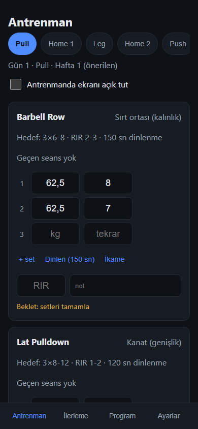
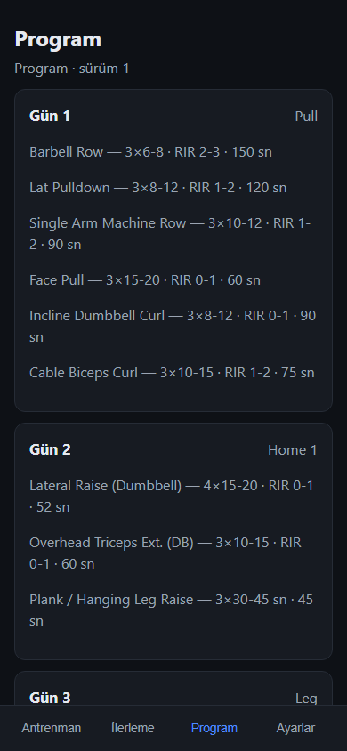
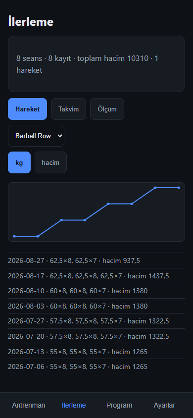

# TrainLog

Kişisel antrenman takip uygulaması: **çevrimdışı çalışan, sunucusuz, tek kullanıcılık bir
PWA**. iPhone'da Safari → *Ana Ekrana Ekle* ile kurulur; verinin tamamı cihazda durur,
hiçbir yere gönderilmez.

Excel tabanlı bir prototipin yerine geçmek için yazıldı: aynı program, aynı sütun düzeni,
ama salonda tek elle kullanılabilen bir arayüz ve dosya kaybetmeyen bir yedek zinciri.

**Canlı:** <https://hasandemirr.github.io/TrainLog/>

| Antrenman | Program | İlerleme |
|---|---|---|
|  |  |  |

*(Ekran görüntülerindeki veri sentetiktir.)*

## Ne yapar

- **Antrenman kaydı** — sıradaki günü önerir; iri sayısal set girişi (virgüllü ondalık),
  "geçeni al", hedef bandına göre artır/beklet ipucu, hacim düşüşü uyarısı, RIR ve not.
- **Dinlenme sayacı** — mutlak bitiş zamanıyla: telefon kilitlenip açılsa da kalan süre
  doğru. Ses yok, görsel uyarı var.
- **İkame** — hareketi yalnızca o seanslığına değiştirir; programa dokunmaz.
- **İlerleme** — hareket bazlı kg/hacim eğrisi, takvim ay görünümü ve gün özeti, genel
  istatistikler, ölçüm takibi.
- **Program yönetimi** — düzenleme yeni bir *sürüm* yaratır; geçmiş seanslar açıldıkları
  sürümün hedeflerini taşımaya devam eder ("o gün hedef neydi?" her zaman cevaplanır).
- **Yedek** — JSON dışa/içe aktarma. Geri yükleme **ezmez, birleştirir**. Yedek yaşı hep
  görünür, 21 gün geçerse hatırlatır. Ayrıca tek yönlü CSV dışa aktarma (tablo programları için).

## Neden böyle

- **Yerel-öncelikli:** otorite cihazdadır, bulut kanonik değildir. Bugün senkron yoktur ve
  uygulama senkronsuz eksiksizdir.
- **Kalıcı depolama bir izindir, garanti değil:** bu yüzden asıl kurtarma mekanizması
  yedektir, ve yedeğin yaşı kullanıcıya sürekli gösterilir.
- **Sürümlü program:** geçmişi doğru anlatabilmek için programlar değişmez sürüm zinciridir.
- **Bağımlılık disiplini:** çalışma zamanında yalnızca Preact. Grafikler, doğrulama, CSV,
  service worker eklentisi — hepsi elle yazıldı.

## Yığın

| Katman | Seçim |
|---|---|
| Çalışma zamanı bağımlılığı | **Preact** (yalnızca) |
| Derleme | Vite + TypeScript (strict) |
| Test | Vitest (yalnız saf çekirdek) + tek Playwright duman testi |
| Depolama | `localStorage`, `StoragePort` arkasında |
| Dağıtım | GitHub Pages (GitHub Actions), statik |

Bütçe: JS paketi ~24 KB gzip (tavan ~150 KB); durum nesnesi kayıt başına ~150 bayt.

## Mimari (özet)

Dört katman: **operasyonel durum → kalıcılık güçlendirme → yedek → (opsiyonel) uzak hedef.**
Tek depo, tek yönlü akış: `yükle → göç → indeksle → çiz → aksiyon → kaydet → çiz`.

Bağımlılık yönü kuralı tektir ve ihlal edilmez:

```
ui/  →  app/ (ports)  →  domain/ (saf, hiçbir şey import etmez)
              ▲
        adapters/ (portları uygular) — main.ts kablolar
```

`domain/` DOM, depo ya da tarayıcı API'si görmez; ilerleme kuralı, birleştirme, göç,
doğrulama ve CSV üretimi burada saf fonksiyondur — test yüzeyinin tamamı budur.

## Geliştirme

```bash
npm install
npm run dev          # yerel geliştirme
npm run typecheck    # tsc --noEmit (strict)
npm test             # vitest (saf çekirdek)
npm run test:e2e     # Playwright duman testi
npm run build        # üretim derlemesi + SW ön-önbellek listesi
```

Service worker yalnızca üretim derlemesinde kaydolur (`build` + `preview`).

## Belgeler

- [`DECISIONS.md`](DECISIONS.md) — otoriter karar kaydı (numaralı; tartışmalarda referans)
- [`ARCHITECTURE.md`](ARCHITECTURE.md) — katmanlar, veri modeli, iOS tuzakları, bütçeler
- [`ROADMAP.md`](ROADMAP.md) — sprintler, sprint kapısı, cihaz kontrol listesi
- [`docs/sprint-notes/`](docs/sprint-notes/) — her sprintin devir notu

Depoda gerçek antrenman verisi bulunmaz; testler ve ekran görüntüleri sentetiktir.
