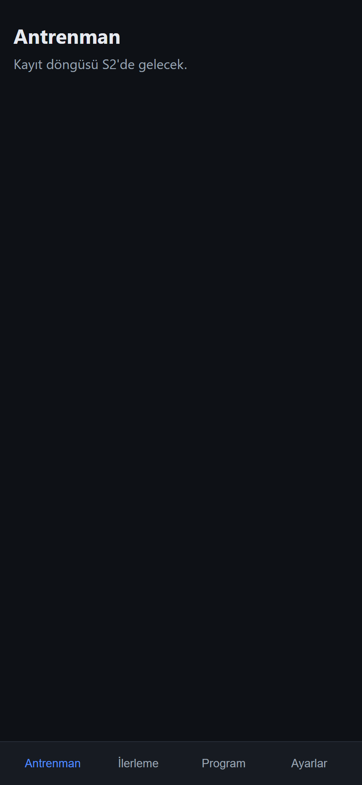
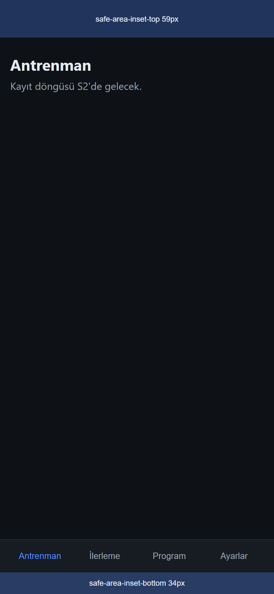

# S0 — Yürüyen iskelet — Sprint Notu

**Tarih:** 2026-08-13 · **Dal/akış:** `main` üstünde küçük tek-konulu commit'ler;
push sahibe bırakıldı (D50). **Node:** yerel v26, CI'da 20 (D32).

Bu not mimar incelemesinin girdisidir (CLAUDE.md → Sprint kapanışı).

## 1. Kapsam & sonuç (ROADMAP S0)

| Kapsam kalemi | Durum | Nerede |
|---|---|---|
| Vite+TS+Preact iskeleti, `base:'./'` | ✅ | `package.json`, `tsconfig.json`, `vite.config.ts`, `index.html` |
| Klasör ağacı | ✅ (S0 kullandığı kadarı) | `src/{app,adapters,ui,pwa}` |
| Hash router (D40) | ✅ | `src/ui/router.ts` |
| Boş dört sekme (D45) | ✅ | `src/ui/{App.tsx,components/TabBar.tsx,views/*}` |
| SW ön-önbellek + güncelleme çubuğu (D41) | ✅ | `src/pwa/{sw.ts,register.ts}`, `vite.config.ts` eklentisi, `src/ui/components/UpdateBar.tsx` |
| StoragePort + local adaptör (D7, D23) | ✅ | `src/app/ports.ts`, `src/adapters/storage.local.ts` |
| Persist kontrolü (D25) | ✅ | `requestPersist()` → Ayarlar'da görünür |
| Pages dağıtım workflow'u | ✅ (dosya) | `.github/workflows/deploy.yml` |

## 2. Sprint kapısı durumu (altı madde)

1. **typecheck + test yeşil** — ✅ `tsc --noEmit` temiz; `vitest run` 0 kodla çıkıyor. *S0'da domain testi yok:* S0 altyapı sprinti, domain mantığı S1'de doğuyor; `passWithNoTests` bilerek açık. Şartname kapsanıyor çünkü S0 şartnamesi domain-dışı.
2. **build + Playwright dumanı yeşil; bütçe** — ✅ `npm run build` temiz; Playwright 2/2 geçti; bütçe bkz. §6 (fazlasıyla altında).
3. **Pages önizlemesi dağıtılmış** — ⏳ *Sahip.* Workflow hazır; ilk push'ta dağıtır. Sahip: Settings → Pages → Source **GitHub Actions** işaretli olmalı (ROADMAP ilk kurulum md.3).
4. **KL-C cihazda** — ⏳ *Sahip.* S0 odağı KL-C 1-3, 8; ayrıntı §5.
5. **Mimar incelemesi + öneriler** — ⏳ *Mimar.* S0'da **karar önerisi (proposal) yok**; hiçbir kilitli karardan sapılmadı.
6. **DECISIONS güncel + sahip mührü** — ⏳ *Sahip.* DECISIONS'a dokunulmadı; push sahibin.

## 3. Uygulanan kararlar

D2 (`base:'./'`, statik host, apple-touch), D6 (tek-yönlü akış iskeleti; tam store S1),
D7 (port yönü; adaptör portu uygular), D23 (localStorage StoragePort arkasında),
D24 (senkron kayıt), D25 (persist kontrolü/talebi + görünür durum),
D26 (depo erişilemezse sessiz düşüş), D32-33 (araç zinciri; yalnızca Preact runtime),
D34 (vitest domain hedefli; UI testi yok), D35 (bütçe + temiz konsol),
D36 (hash'li app-shell ön-önbelleği, elle sürüm yok), D40 (hash router, üst görünüm pushState),
D41 (kendi SW eklentimiz; vite-plugin-pwa değil; sessiz otomatik yenileme yok),
D45 (dört sekme), D48 (kod İngilizce/UI Türkçe), D49 (repoya gerçek veri girmedi; ikonlar sentetik).

## 4. Mimarın bakması gereken noktalar

- **`src/pwa/register.ts` eklendi** — ARCH §4 ağacı yalnızca `pwa/sw.ts` listeliyor. Kayıt/güncelleme kablolaması `pwa/` altında ayrı dosyaya kondu (main.ts enjekte ediyor, ui adaptör import etmiyor). Ağaç ihlali mi, kabul mü?
- **`app/ports.ts` yalnızca `StoragePort` + `PersistStatus` tanımlıyor.** SyncPort/BackupPort **bilerek eklenmedi** — imzalarını kendi sprintlerinden (senkron tetiği / S3 yedek) önce kilitlememek için. ARCH §2 üçünü de ports.ts'te tarif ediyor; bu erteleme onaylanıyor mu?
- **S0 geçici boot sayacı** (`src/main.ts`) — kalıcılık round-trip'i ve KL-C 8'i kanıtlamak için tek placeholder. S1'de gerçek `AppState` + göç + store ile **kaldırılacak**. Ayarlar'daki "Açılış sayısı" ve "S0 geçici" etiketi bu yüzden.
- **SW eklentisi `vite.config.ts` içine gömülü** (ayrı dosya değil) — ARCH ağacını genişletmemek için. ~30 satır; D41'in "kendi eklentimiz" şartını karşılıyor.
- **SW yalnızca `import.meta.env.PROD`'da kaydolur.** `npm run dev`'de SW yok (HMR ile çakışmasın); güncelleme akışı yalnızca `build`+`preview` / dağıtımda görünür.
- **tsconfig katılığı:** `strict` + `noUncheckedIndexedAccess` + `verbatimModuleSyntax` + `noUnused*` açık; `exactOptionalPropertyTypes` **açılmadı** (Preact opsiyonel prop'larında sürtünme). Mimar tercihi?
- **Playwright CI'da değil** — dağıtım hattı yalın; duman geliştiricinin yerel kapısı. İstenirse ayrı bir CI test işi eklenebilir.
- **Doğrulama notu:** güncelleme akışı (waiting → çubuk → Yenile → yeni sürüm, veri korunur) önizlemede uçtan uca doğrulandı. Tarayıcı panelinde bir gerçek tık ıskaladı (pane compositing); DOM tık'ıyla teyit edildi. Cihazdaki gerçek onay KL-C 8.

## 5. KL-C — sahibin cihazda denemesi gerekenler (S0 odağı: 1-3, 8)

- **1 · Kuruluma** — Safari → Ana Ekrana Ekle; ikon (mavi halter) net mi, tam ekran açılıyor mu, safe-area (çentik/alt bar) doğru mu. *(Safe-area kusurları mimar fix turunda düzeltildi — bkz §8; cihazda son onay sende.)*
- **2 · Uçak modu** — kurduktan sonra çevrimiçi bir kez aç (SW ön-önbelleği dolsun), sonra uçak modunda aç: kabuk açılmalı.
- **3 · Persist** — **kurulu modda** Ayarlar'da "Kalıcı depolama: açık" görünmeli. *Uyarı:* normal Safari sekmesinde "geçici" görünebilir; iOS kalıcı depolamayı genelde ana-ekran uygulamasına verir. Sekme ≠ kurulu uygulama (ayrı depolama bölmesi).
- **8 · Güncelleme** — (sonraki dağıtımda) alt barda "Güncelleme hazır — Yenile" çıkmalı; dokununca yenilemeli. "Açılış sayısı" yenilemeden sonra da artarak durmalı (veri kaybı yok).

## 6. Bütçeler (D35)

- JS **gzip ~7.4 KB**, CSS gzip ~0.75 KB → toplam ~8 KB ≪ ~150 KB tavan. Bol pay.
- Durum nesnesi < 1 MB: S0'da anlamlı durum yok (yalnızca boot sayacı).
- Konsol: hata yok (doğrulandı).

## 7. Sonraki sprint kancası (S1 — domain çekirdeği)

- `src/domain/` bu sprintte **yok** (bilerek); S1 `types/ids/progression/merge/migrate/validate` ile doğuruyor.
- S1, `main.ts`'teki geçici boot sayacını gerçek `AppState` + `migrate` v1→v2 + tek-yönlü store ile değiştirir; Ayarlar'daki "S0 geçici" tanılama bloğu kalkar.
- `app/store.ts`, `app/selectors.ts`, `ui/format.ts` S1+ ile gelir (şimdilik yer tutucu dosya konmadı — spekülatif kod yok).

## 8. KL-C 1 safe-area düzeltmesi (mimar fix turu)

iPhone 17 Pro Max'te bildirilen üç kusur giderildi (`src/ui/styles.css`):

1. **Üst inset yoktu** → `.content` üst dolgusu `--sat` ekliyor; başlık saat/çentik altına inmiyor.
2. **Uç sekmeler köşe kavisine yaslanıyordu** → `.tabbar` yatay iç dolgu `12px` (+ yan insetler); sekmeler içeride dağılıyor.
3. **Alt inset çift sayılıyordu** → model: **sabit dokunma satırı `--tabbar-row: 52px`** (etiket dikey ortalı) **+ BİR kez `--sab`**. İçerik alt dolgusu bu toplamı (`--tabbar-h`) kullanır, insedi tekrar eklemez.

**Uygulama kuralı:** insetler tek kaynakta değişkenlere bağlı
(`--sat/--sab/--sal/--sar = env(safe-area-inset-*, 0px)`); bileşenler yalnızca
değişkeni tüketir. Bu yüzden masaüstünde değişkenlere değer basarak doğrulanabilir.

**Doğrulama (masaüstü, Playwright chromium, 430×932):** `--sat/--sab`'a `59px`/`34px`
basıldı. Solda inset yok, sağda inset var; mavi bantlar rezerve edilen güvenli alanı
gösterir (yalnızca doküman için eklenmiş kılavuz). Cihazdaki gerçek onay KL-C 1 (sende).

| inset yok | inset 59 / 34 (bantlar kılavuz) |
|---|---|
|  |  |
